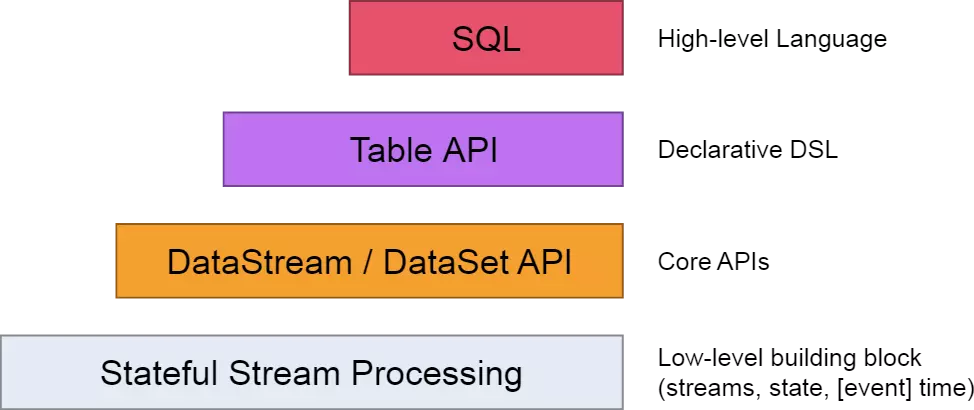
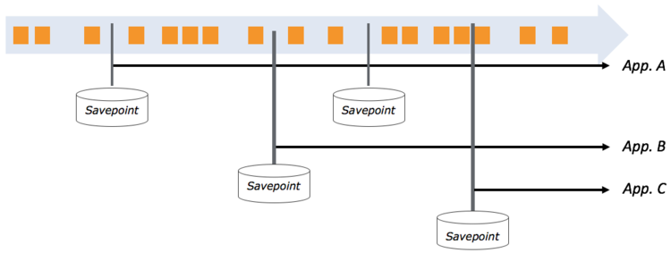
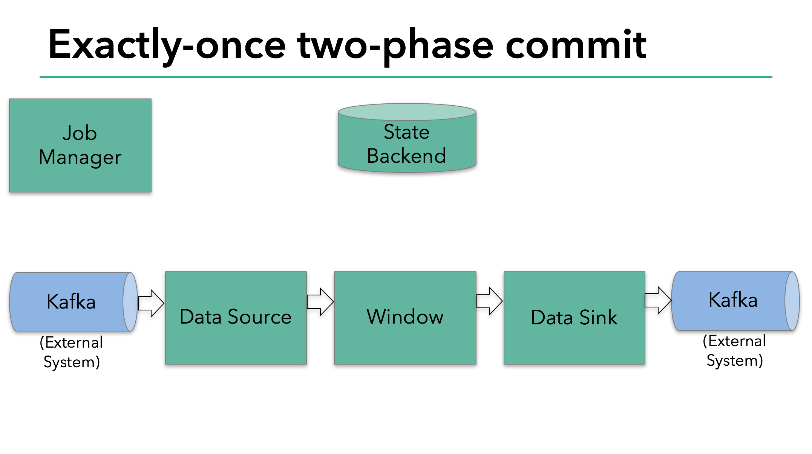
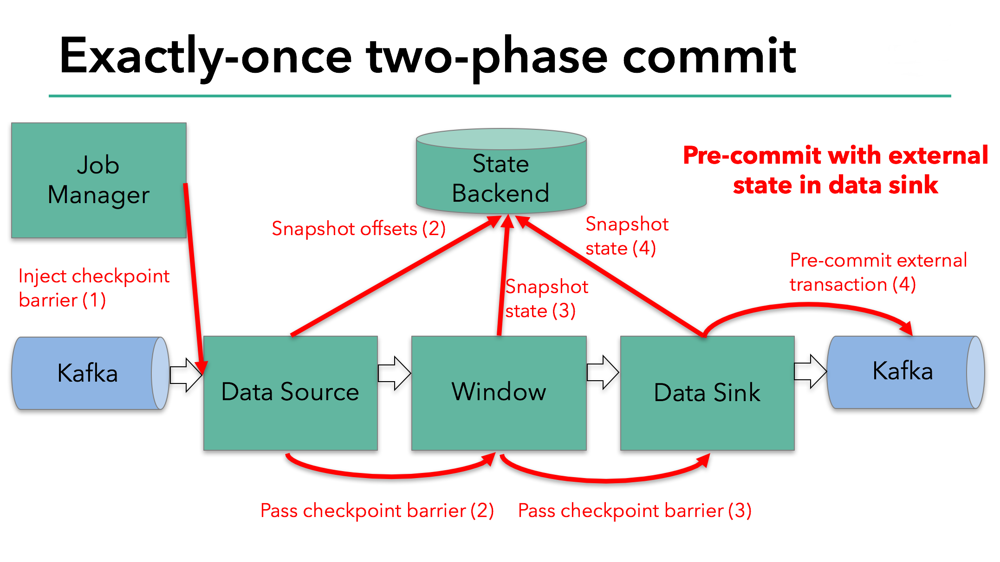
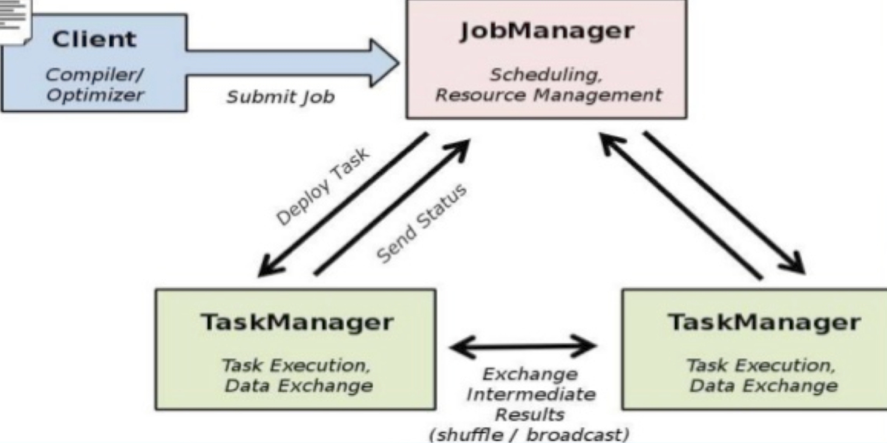
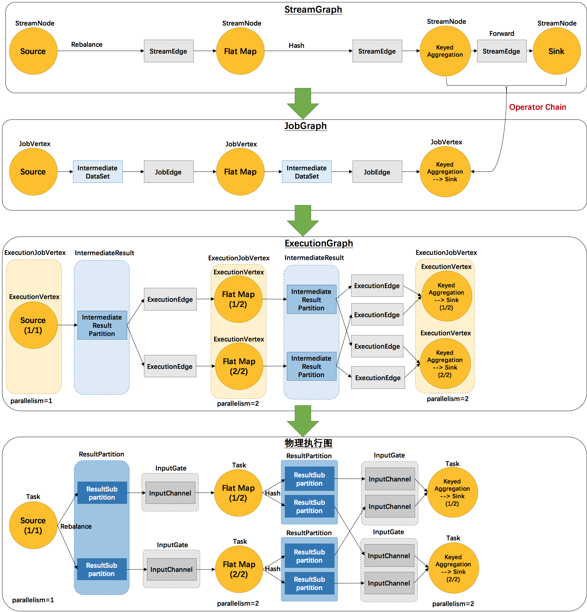

# Flink & sloth

## Flink
### 概述
Flink是一个面向数据流处理和批量数据处理的可分布式的开源计算框架，它基于同一个Flink流式执行模型（streaming execution model），能够支持流处理和批处理两种应用类型。由于流处理和批处理所提供的SLA(服务等级协议)是完全不相同， 流处理一般需要支持低延迟、Exactly-once保证，而批处理需要支持高吞吐、高效处理，所以在实现的时候通常是分别给出两套实现方法，或者通过一个独立的开源框架来实现其中每一种处理方案。比较典型的有：实现批处理的开源方案有MapReduce、Spark；实现流处理的开源方案有Storm；Spark的Streaming 其实本质上也是微批处理。

### DataSet / DataStream
DataSet是一种有限集合,DataStream是无界的.两者都是不可变对象,数据一旦创建就不能添加或者删除.

### API支持

* DataStream API
* DataSet API
* Table API
* Streaming SQL

有状态的数据流处理层:最底层的抽象仅仅提供有状态的数据流，它通过处理函数（Process Function）嵌入到数据流api(DataStream API). 用户可以通过它自由的处理单流或者多流，并保持一致性和容错。同时用户可以注册事件时间和处理时间的回调处理，以实现复杂的计算逻辑。

核心API层:它提供了数据处理的基础模块，像各种transformation, join,aggregations,windows,stat 以及数据类型等等

Table API层:定了围绕关系表的DSL(领域描述语言)。Table API遵循了关系模型的标准：Table类型关系型数据库中的表，API也提供了相应的操作，像select,project,join,group-by,aggregate等。Table API声明式的定义了逻辑上的操作（logical operation）不是code for the operation；Flink会对Table API逻辑在执行前进行优化。同时代码上，Flink允许混合使用Table API和DataStram/DataSet API

SQL层:它很类似Table API的语法和表达，也是定义与Table API层次之上的，但是提供的是纯SQL的查询表达式。

### 窗口
流处理中的聚合操作（counts,sums等等）不同于批处理，因为数据流是无限，无法在其上应用聚合，所以通过限定窗口(window)的范围，来进行流的聚合操作。例如：5分钟的数据计数，或者计算100个元素的总和等等。
窗口可以由时间驱动 (every 30 seconds) 或者数据驱动(every 100 elements)。如：滚动窗口tumbling windows（无叠加），滑动窗口sliding windows（有叠加），以及会话窗口session windows(被无事件活动的间隔隔开)


### 时间
Flink 有三种不同的时间概念：

* Event Time：事件的创建时间，通常通过事件中的一个时间戳来描述
* Ingestion time： 事件进入Flink 数据流的source的时间
* Processing Time:Processing Time表示某个Operator对事件进行处理时的本地系统时间（是在TaskManager节点上）

### watermark & 乱序
如果消息都是顺序到达,接收到任何一个event后,都可以任务这个时间点之前的数据都已经到达了.以下图为例,w(11)表示11之前的数据都已经到达,w(20)同理

但是分布式系统中的数据并不能完全保证是有序的,可能是以一下顺序到达的:


watermark是用于处理乱序事件的，而正确的处理乱序事件，通常用watermark机制结合window来实现。在watermark大于window的时间的时候,才开始计算

迟到事件出现时窗口已经关闭并产出了计算结果，因此处理的方法有3种：

* 重新激活已经关闭的窗口并重新计算以修正结果。
* 将迟到事件收集起来另外处理。
* 将迟到事件视为错误消息并丢弃。

Flink 默认的处理方式是第3种直接丢弃，其他两种方式分别使用Side Output和Allowed Lateness。

### 应用开发

Flink程序类似普通的java中集合变换.每个Program由以下概念组成:
* 获得execution environment
* load/create初始化数据
* 指定数据的处理函数Specify transformations on this data)
* 指定存储器
* 执行

#### 获取env
```java
getExecutionEnvironment()

createLocalEnvironment()

createRemoteEnvironment(String host, int port, String... jarFiles)
```

#### demo
Stream
```java
public class WindowWordCount {

    public static void main(String[] args) throws Exception {

        StreamExecutionEnvironment env = StreamExecutionEnvironment.getExecutionEnvironment();

        DataStream<Tuple2<String, Integer>> dataStream = env
                .socketTextStream("localhost", 9999)
                .flatMap(new Splitter())
                .keyBy(0)
                .timeWindow(Time.seconds(5))
                .sum(1);

        dataStream.print();

        env.execute("Window WordCount");
    }

    public static class Splitter implements FlatMapFunction<String, Tuple2<String, Integer>> {
        @Override
        public void flatMap(String sentence, Collector<Tuple2<String, Integer>> out) throws Exception {
            for (String word: sentence.split(" ")) {
                out.collect(new Tuple2<String, Integer>(word, 1));
            }
        }
    }

}
```
Batch
Integer:string:Integer

```java
public class MySQLSink extends
		RichSinkFunction<Tuple3<Integer, String, Integer>> {
 
	private static final long serialVersionUID = 1L;
	private Connection connection;
	private PreparedStatement preparedStatement;
	String username = "test";
	String password = "test";
	String drivername = Config.getString("mysql.driver");
	String dburl = "127.0.0.1:3306";
 
	@Override
	public void invoke(Tuple3<Integer, String, Integer> value) throws Exception {
		Class.forName(drivername);
		connection = DriverManager.getConnection(dburl, username, password);
		String sql = "replace into orders(order_id,order_no,order_price) values(?,?,?)";
		preparedStatement = connection.prepareStatement(sql);
		preparedStatement.setInt(1, value.f0);
		preparedStatement.setString(2, value.f1);
		preparedStatement.setInt(3, value.f2);
		preparedStatement.executeUpdate();
		if (preparedStatement != null) {
			preparedStatement.close();
		}
		if (connection != null) {
			connection.close();
		}
 
	}
 
}

public class KafkaToDB {
	public static void main(String[] args) throws Exception {
		Properties pro = new Properties();
		pro.put("bootstrap.servers", Config.getString("kafka.hosts"));
		pro.put("zookeeper.connect", Config.getString("kafka.zookper"));
		pro.put("group.id", Config.getString("kafka.group"));
		StreamExecutionEnvironment env = StreamExecutionEnvironment
				.getExecutionEnvironment();
		env.getConfig().disableSysoutLogging();
		env.getConfig().setRestartStrategy(
				RestartStrategies.fixedDelayRestart(4, 10000));
		env.enableCheckpointing(5000);
		DataStream<String> sourceStream = env
				.addSource(new FlinkKafkaConsumer08<String>(Config
						.getString("kafka.topic"), new SimpleStringSchema(),
						pro));
 
		DataStream<Tuple3<Integer, String, Integer>> sourceStreamTra = sourceStream.filter(new FilterFunction<String>() {	
			@Override
			public boolean filter(String value) throws Exception {
				return StringUtils.isNotBlank(value);
			}
		}).map(new MapFunction<String, Tuple3<Integer, String, Integer>>() {
			private static final long serialVersionUID = 1L;
					@Override
					public Tuple3<Integer, String, Integer> map(String value)
							throws Exception {
						String[] args = value.split(":");
						return new Tuple3<Integer, String, Integer>(Integer
								.valueOf(args[0]), args[1],Integer
								.valueOf(args[2]));
					}
				});
		
		sourceStreamTra.addSink(new MySQLSink());
		env.execute("data to mysql start");
	}
}
```
sql
```java
public class TableJob {

    public static void main(String[] args) throws Exception{
        ExecutionEnvironment env = ExecutionEnvironment.getExecutionEnvironment();
        env.setParallelism(1);
        BatchTableEnvironment tableEnv = BatchTableEnvironment.getTableEnvironment(env);

        DataSet<TopScorers> csvInput = env
                .readCsvFile("E://flink-training-exercises//src//main//resource//2016_Chinese_Super_League_Top_Scorers.csv")
                    .ignoreFirstLine() .pojoType(TopScorers.class,"rank","player","country","club","total_score","total_score_home","total_score_visit","point_kick");

        Table topScore = tableEnv.fromDataSet(csvInput);
        tableEnv.registerTable("topScore",topScore);
        Table groupedByCountry = tableEnv.sql("select country,sum(total_score) as sum_total_score from topScore group by country order by 2 desc");
        DataSet<Result> result = tableEnv.toDataSet(groupedByCountry,Result.class);
        result.map(new MapFunction<Result, Tuple2<String,Integer>>() {
            @Override
            public Tuple2<String, Integer> map(Result result) throws Exception {
                String country = result.country;
                int sum_total_score = result.sum_total_score;
                return Tuple2.of(country,sum_total_score);
            }
        }).print();
    }

    public static class TopScorers {
        public int rank;
        public String player;
        public String country;
        public String club;
        public int total_score;
        public int total_score_home;
        public int total_score_visit;
        public int point_kick;

        public TopScorers() {
            super();
        }
    }

    public static class Result {
        public String country;
        public int sum_total_score;

        public Result() {}
    }
}
```

### save point
Flink的savepoint是一个全局的、一致性的快照（snapshot）。其包含两方面：

数据源所有数据的位置；
并行操作的状态
“全局一致”是指所有的输入源数据在指定的位置，所有的并行操作的状态都被完全checkpoint了。
如果你的应用在过去某个时间点做了savepoint，那你随时可以从前面的savepoint更新发布应用

### Exactly Once

Exactly-once:每个输入的event对于最终的结果有且只有一次影响.
首先需要理解checkpoint,checkpoint是一种分布式一致性的快照:
* 当前应用的状态
* 输入流的位置
Flink定时持久化checkpoint.持久化的流程是异步的,这样在持久化checkpoint时,不会影响Flink中应用的进度.
在异常和重启时,Flink从最新的checkpoint进行恢复.1.4.0之前的版本,exactly-once的语义只能用在Flink Application上,不能扩展到接受处理后的数据的外部系统中.但是通常Flink需要和一系列的持久化系统进行对接,开发者需要维护exactly-once的语义.
为了提供端到端的exacly-once的语义,也就意味着外部系统必须能够协助提供提交或者回滚的功能,以便于保持和Flink的checkpoint一直的状态.

#### api
```java
// start a checkpoint every 1000 ms
env.enableCheckpointing(1000);

// advanced options:

// set mode to exactly-once (this is the default)
env.getCheckpointConfig().setCheckpointingMode(CheckpointingMode.EXACTLY_ONCE);
```

### State Backend
Flink的checkpoint机制在定时器和有状态的算子中保存了所有State的一致性快照，包括Connectors、windows以及任何用户自定义state。checkpoint保存在哪(如:JobManager内存、文件系统、数据库)取决于配置的State Backend。
默认情况下，State保存在TaskManager的内存中而checkpoint保存在JobManager的内存中，为了适当的保存大型State，Flink支持各种方法来在其他State后端存储和checkpoint State。State后端的选择可以通过StreamExecutionEnvironment.setStateBackend(...)来配置。

### Barrier

Flink 分布式快照的核心概念之一就是数据栅栏（barrier）。这些 barrier 被插入到数据流中，作为数据流的一部分和数据一起向下流动。Barrier 不会干扰正常数据，数据流严格有序。一个 barrier 把数据流分割成两部分：一部分进入到当前快照，另一部分进入下一个快照。每一个 barrier 都带有快照 ID，并且 barrier 之前的数据都进入了此快照。Barrier 不会干扰数据流处理，所以非常轻量。多个不同快照的多个 barrier 会在流中同时出现，即多个快照可能同时创建。

Barrier 在数据源端插入，当 snapshot n 的 barrier 插入后，系统会记录当前 snapshot 位置值 n (用Sn表示)。例如，在 Apache Kafka 中，这个变量表示某个分区中最后一条数据的偏移量。这个位置值 Sn 会被发送到一个称为 checkpoint coordinator 的模块。(即 Flink 的 JobManager).

然后 barrier 继续往下流动，当一个 operator 从其输入流接收到所有标识 snapshot n 的 barrier 时，它会向其所有输出流插入一个标识 snapshot n 的 barrier。当 sink operator （DAG 流的终点）从其输入流接收到所有 barrier n 时，它向 the checkpoint coordinator 确认 snapshot n 已完成。当所有 sink 都确认了这个快照，快照就被标识为完成。


接收超过一个输入流的 operator 需要基于 barrier 对齐（align）输入。参见上图：

operator 只要一接收到某个输入流的 barrier n，它就不能继续处理此数据流后续的数据，直到 operator 接收到其余流的 barrier n。否则会将属于 snapshot n 的数据和 snapshot n+1的搞混

barrier n 所属的数据流先不处理，从这些数据流中接收到的数据被放入接收缓存里（input buffer）

当从最后一个流中提取到 barrier n 时，operator 会发射出所有等待向后发送的数据，然后发射snapshot n 所属的 barrier

经过以上步骤，operator 恢复所有输入流数据的处理，优先处理输入缓存中的数据

### 流程






#### 总结
保证exactly-once是需要源端，streaming系统和输出共同协作，主要的要求是
1.源端要支持重放, 比如Kafka，Amazon Kinesis
2. 中间streaming系统的容错处理保证task只会产生exactly-once的输出
3. 输出端要有transactional update下游输出幂等的情况比较好处理，streaming系统输出结果可以直接update下游输出不幂等，需要引入版本控制机制可以参考:

#### TwoPhaseCommitSinkFunction & FlinkKafkaProducer011
TwoPhaseCommitSinkFunction 作为两阶段的一个抽象实现,规定了以下的接口:
https://ci.apache.org/projects/flink/flink-docs-release-1.4/api/java/org/apache/flink/streaming/api/functions/sink/TwoPhaseCommitSinkFunction.html

FlinkKafkaProducer011实现如下
```java
@Override
protected KafkaTransactionState beginTransaction() throws FlinkKafka011Exception {
    switch (semantic) {
        case EXACTLY_ONCE:
            FlinkKafkaProducer<byte[], byte[]> producer = createTransactionalProducer();
            producer.beginTransaction();
            return new KafkaTransactionState(producer.getTransactionalId(), producer);
            ```
    }
}

@Override
protected void preCommit(KafkaTransactionState transaction) throws FlinkKafka011Exception {
    switch (semantic) {
        case EXACTLY_ONCE:
        case AT_LEAST_ONCE:
            flush(transaction);
        ...
}

@Override
protected void commit(KafkaTransactionState transaction) {
    if (transaction.isTransactional()) {
        try {
            transaction.producer.commitTransaction();
        } finally {
            recycleTransactionalProducer(transaction.producer);
        }
    }
}

@Override
protected void abort(KafkaTransactionState transaction) {
    if (transaction.isTransactional()) {
        transaction.producer.abortTransaction();
        recycleTransactionalProducer(transaction.producer);
    }
}
```

## Flink 拓扑 & 数据流
### 部署拓扑
Flink总体是一个master-slave结构的分布式集群


### 执行拓扑

 * StreamGraph:根据用户通过 Stream API 编写的代码生成的最初的图。 
 * StreamNode:用来代表 operator 的类，并具有所有相关的属性，如并发度、入边和出边等。
 * StreamEdge:表示连接两个StreamNode的边。 
 * JobGraph:StreamGraph经过优化后生成了 JobGraph，提交给 JobManager 的数据结构。 
 * JobVertex:经过优化后符合条件的多个StreamNode可能会chain在一起生成一个JobVertex，即一个JobVertex包含一个或多个operator，JobVertex的输入是JobEdge，输出是IntermediateDataSet。 
 * IntermediateDataSet: 表示JobVertex的输出，即经过operator处理产生的数据集。producer是JobVertex，consumer是JobEdge。 
 * JobEdge:代表了job graph中的一条数据传输通道。source 是 IntermediateDataSet，target 是 JobVertex。即数据通过JobEdge由IntermediateDataSet传递给目标JobVertex。 
* ExecutionGraph: JobManager 根据 JobGraph 生成的分布式执行图，是调度层最核心的数据结构。
* ExecutionJobVertex: 和JobGraph中的JobVertex一一对应。每一个ExecutionJobVertex都有和并发度一样多的 ExecutionVertex。 
* ExecutionVertex：表示ExecutionJobVertex的其中一个并发子任务，输入是ExecutionEdge，输出是IntermediateResultPartition。
* IntermediateResult:和JobGraph中的IntermediateDataSet一一对应。每一个IntermediateResult有与下游ExecutionJobVertex相同并发数的IntermediateResultPartition。
* IntermediateResultPartition:表示ExecutionVertex的一个输出分区，producer是ExecutionVertex，consumer是若干个ExecutionEdge。
* ExecutionEdge:表示ExecutionVertex的输入，source是IntermediateResultPartition，target是ExecutionVertex。source和target都只能是一个。 
* Execution:是执行一个 ExecutionVertex 的一次尝试。当发生故障或者数据需要重算的情况下 ExecutionVertex 可能会有多个 ExecutionAttemptID。一个 Execution 通过 ExecutionAttemptID 来唯一标识。JM和TM之间关于 task 的部署和 task status 的更新都是通过 ExecutionAttemptID 来确定消息接受者。 
* 物理执行图:JobManager 根据 ExecutionGraph 对 Job 进行调度后，在各个TaskManager 上部署 Task 后形成的“图”，并不是一个具体的数据结构。 
* Task:execution被调度后在分配的 TaskManager 中启动对应的 Task。Task 包裹了具有用户执行逻辑的 operator。 
* ResultPartition:代表由一个Task的生成的数据，和ExecutionGraph中的IntermediateResultPartition一一对应。 
* ResultSubpartition:是ResultPartition的一个子分区。每个ResultPartition包含多个ResultSubpartition，其数目要由下游消费 Task 数和 DistributionPattern 来决定。
* InputGate:代表Task的输入封装，和JobGraph中JobEdge一一对应。每个InputGate消费了一个或多个的ResultPartition。 
* InputChannel:每个InputGate会包含一个以上的InputChannel，和ExecutionGraph中的ExecutionEdge一一对应，也和ResultSubpartition一对一地相连，即一个InputChannel接收一个ResultSubpartition的输出。

### TaskManager

每个worker(TaskManager)都是一个JVM进程，每个子任务都是运行在独立的线程中。为了控制一个worker接收任务的数量，一个任务会分配至少一个任务槽。

每一个任务槽都代表了一个TaskManager中特定的资源池子集。比如 TaskManager有三个任务槽，每个任务槽都有该TaskManager1/3的管理内存。将资源分槽意味着每一个计算子任务都有指定容量的内存资源，从而不会和其他子任务发生竞争。注意，这里没有对CPU隔离；任务槽只会隔离对应任务的内存。

用户通过调整任务槽的数量，可以自定义每个任务的计算子任务的数量。每个TaskManager只有一个任务槽的话，说明每个任务组都跑在一个独立的JVM上（如果Flink启动在一个独立的容器中）。有多个任务槽说明了有多个计算子任务在共享同一个JVM。在同一个JVM下的任务共享TCP连接(multiplexing：通过多路复用的方式)和心跳信息。任务之间也会共享数据集和数据结构，从而减少每个任务的开销。
