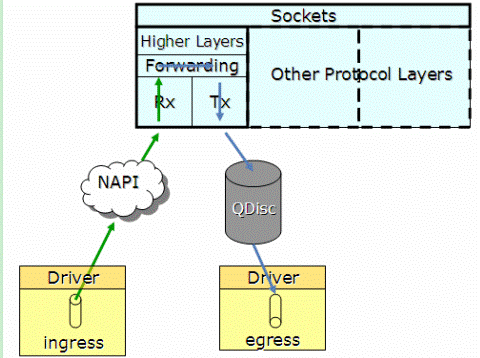

1.内存占用
2.问题排查
    time_wait过多: 
    close_wait过多: 被动关闭没有close
3.流程
    a.三次握手
    b.四次挥手
# network
## tcp
字节流
### 流程
* 三路握手
1. 客户端发起连接,sync(cid)
2. 服务器端 sync(sid),ack(cid+1)
3. 客户端ack(sid+1)

* 四次挥手
1. 客户端fin包:fin(cid) c: estabished->Fin_wait1, s : estabished->CLOSE_WAIT
2. 服务器端ack :ack(cid+1) c: Fin_wait1->Fin_wait2 s:nothing to change
3.服务器端fin: fin(sid) c:Fin_wait2->Time_wait, s: CLOSE_WAIT LAST_ACK
3. 客户端ack: ack(sid+1) c Time_wait s:Last_ack close

### 可靠性保证
* 应用程序被分割成TCP认为的最合适的发送的数据段
* TCP 发送一个段后,启动定时器,等待目的端确认收到这个报文段,如果不能则重发
* TCP 收到TCP另一端的诗句,将发送一个确认,这个确认不是立即发送的
* TCP校验受不和数据检验和,目的是检测数据在传输过程中的变化
* 对乱序的ip数据进行排序
* 丢弃重复数据
* 进行流量控制,tcp连接的每一方都有固定大小的缓冲空间

有的mq使用时会等待前面前面的消费掉才处理
### 问题
time_wait过多: 
close_wait过多: 被动关闭没有close

### 配置
vim /etc/security/limits.conf

* soft nofile 655350
* hard nofile 655350

#表示开启SYN Cookies。当出现SYN等待队列溢出时，启用cookies来处理，可防范少量SYN攻击，默认为0，表示关闭
net.ipv4.tcp_syncookies = 1

#表示开启重用。允许将TIME-WAIT sockets重新用于新的TCP连接，默认为0，表示关闭
net.ipv4.tcp_tw_reuse = 1

#表示开启TCP连接中TIME-WAIT sockets的快速回收，默认为0，表示关闭
net.ipv4.tcp_tw_recycle = 1

#表示如果套接字由本端要求关闭，这个参数决定了它保持在FIN-WAIT-2状态的时间
net.ipv4.tcp_fin_timeout=30

#该参数设置系统的TIME_WAIT的数量，如果超过默认值则会被立即清除
net.ipv4.tcp_max_tw_buckets = 20000

#定义了系统中每一个端口最大的监听队列的长度，这是个全局的参数
net.core.somaxconn = 65535

#对于还未获得对方确认的连接请求，可保存在队列中的最大数目
net.ipv4.tcp_max_syn_backlog = 262144

#在每个网络接口接收数据包的速率比内核处理这些包的速率快时，允许送到队列的数据包的最大数目
net.core.netdev_max_backlog = 30000

#能够更快地回收TIME-WAIT套接字。此选项会导致处于NAT网络的客户端超时，建议为0
net.ipv4.tcp_tw_recycle = 0

#系统所有进程一共可以打开的文件数量
fs.file-max = 6815744

#单个进程可以打开的文件数目
fs.nr_open

net.ipv4.tcp_tw_reuse = 1
net.ipv4.tcp_tw_recycle = 1

#### 硬件配置
网卡多队列, 一个网卡有多个硬件队列, 通过hash包头SIP,SPORT,DIP,DPORT四元组,将一条流放到相同的队列.
kernel从2.6.21之前不支持多队列特性，一个网卡只能申请一个中断号，因此同一个时刻只有一个核在处理网卡收到的包
通过Sum=Min（网卡queue，CPU core）得出所要激活的网卡queue数量（Sum），并申请Sum个中断号，分配给激活的各个queue。

当某个queue收到报文时，触发相应的中断，收到中断的核，将该任务加入到协议栈负责收包的该核的NET_RX_SOFTIRQ队列中（NET_RX_SOFTIRQ在每个核上都有一个实例），在NET_RX_SOFTIRQ中，调用NAPI的收包接口，将报文收到CPU中如图3.2的有多个netdev_queue的net_device数据结构中。

这样，CPU的各个核可以并发的收包，就不会应为一个核不能满足需求，导致网络IO性能下降。

### tcp fast open
* 内核版本 3.7.0
*也就是说，第一次TCP连接只是交换cookie信息，无法在SYN包中携带数据。在第一次交换之后，接下来的TCP连接就可以在SYN中携带数据了。流程如下：

1. 客户端发送一个SYN包，这个包比较特殊，因为它携带应用数据和cookie；

2. 服务器验证这个cookie，如果合法，服务器发送一个SYN＋ACK，这个ACK同时确认SYN和数据。然后数据被传递到应用进程；在连接完成之前server可以给client发送响应数据，携带的数据量受到TCP拥塞控制的限制(RFC5681，后面文章会介绍拥塞控制)。

    如果不合法，服务器丢弃数据，发送一个SYN＋ACK，这个ACK只确认SYN，接下来走三次握手的普通流程；

3. 如果验证合法（接收了SYN包中的数据），服务器在接收到客户端的第一个ACK前可以发送其它响应数据；

4. 如果验证不合法（客户端在SYN中带的数据没被确认），客户端发送ACK确认服务器的SYN；并且，数据会在ACK包中重传；

5. 下面的流程与普通的TCP交互流程无异
 
## 选项
reuseaddr : 可以复用time_wait的地址
reuseport : 端口可以被复用
## udp
包流

https://blog.csdn.net/turkeyzhou/article/details/7528182
https://blog.csdn.net/for_tech/article/details/54237556 

