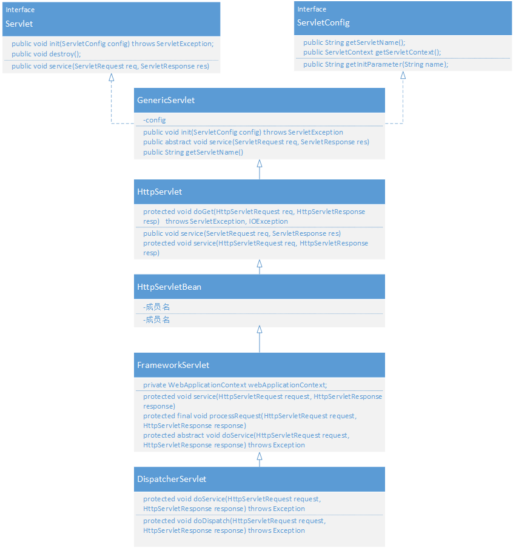

# DispatcherServlet 源码分析

## 说明
DispatcherServlet 是spring中作为http分发的入口,通过配置可以将http path映射到指定的函数上.

## 实例
maven 中添加tomcat插件启动端口8181
```xml
<plugin>
    <groupId>org.apache.tomcat.maven</groupId>
    <artifactId>tomcat7-maven-plugin</artifactId>
    <version>2.2</version>
    <configuration>
        <port>8181</port>
        <path>/</path>
    </configuration>
</plugin>
```
web.xml 中配置
```xml
<?xml version="1.0" encoding="UTF-8"?>
<web-app xmlns:xsi="http://www.w3.org/2001/XMLSchema-instance"
         version="2.5" xmlns="http://java.sun.com/xml/ns/javaee"
         xsi:schemaLocation="http://java.sun.com/xml/ns/javaee http://java.sun.com/xml/ns/javaee/web-app_2_5.xsd">
  <listener>
    <listener-class>com.netease.vcloud.ssc.conf.AdminConfigurationListener</listener-class>
  </listener>
  <listener>
    <listener-class>org.springframework.web.context.ContextLoaderListener</listener-class>
  </listener>

  <context-param>
    <param-name>contextConfigLocation</param-name>
    <param-value>classpath:sysconfig.xml,classpath:applicationContext.xml</param-value>
  </context-param>
  <!-- 配置日志     logback-->
  <context-param>
    <param-name>logbackConfigLocation</param-name>
    <param-value>classpath:logback.xml</param-value>
  </context-param>

  <!--     logback扩展，监听,用于解决与spring的结合 -->
  <listener>
    <listener-class>ch.qos.logback.ext.spring.web.LogbackConfigListener</listener-class>
  </listener>
  <!-- Character Encoding Filter -->
  <filter>
    <filter-name>Set Character Encoding</filter-name>
    <filter-class>org.springframework.web.filter.CharacterEncodingFilter</filter-class>
    <init-param>
      <param-name>encoding</param-name>
      <param-value>UTF-8</param-value>
    </init-param>
  </filter>
  <filter-mapping>
    <filter-name>Set Character Encoding</filter-name>
    <url-pattern>/*</url-pattern>
  </filter-mapping>
  <servlet>
    <servlet-name>webApiServlet</servlet-name>
    <servlet-class>org.springframework.web.servlet.DispatcherServlet</servlet-class>
    <init-param>
      <param-name>contextConfigLocation</param-name>
      <param-value>classpath:mvc.xml</param-value>
    </init-param>
    <load-on-startup>1</load-on-startup>
  </servlet>
  <servlet-mapping>
    <servlet-name>webApiServlet</servlet-name>
    <url-pattern>/</url-pattern>
  </servlet-mapping>
</web-app>
```
上面的配置中,配置DispatcherServlet托管所有的http请求,load-on-startup表示启动时就加载这个Servlet.
```java
@Controller
public class HealthController {
    @RequestMapping(value = "/health/status")
    public void healthStatus(HttpServletRequest request, HttpServletResponse response) {
        try {
            response.setStatus(200);
            response.setContentType("text/html;charset=utf-8");
            response.setCharacterEncoding(ENCODE_CHARSET);
            response.getWriter().println(result);
            response.flushBuffer();
        } catch (IOException e) {
            System.out.println("[writeResult] create exception : " + e + ",msg : " + e.getMessage() + " " + e);
        }
    }
}
```
省略catlina相关信息后的堆栈
```java
"http-bio-8181-exec-1@7248" daemon prio=5 tid=0x29 nid=NA runnable
  java.lang.Thread.State: RUNNABLE
	  at org.springframework.web.servlet.handler.AbstractHandlerMethodMapping.getHandlerInternal(AbstractHandlerMethodMapping.java:308)
	  at org.springframework.web.servlet.handler.AbstractHandlerMethodMapping.getHandlerInternal(AbstractHandlerMethodMapping.java:61)
	  at org.springframework.web.servlet.handler.AbstractHandlerMapping.getHandler(AbstractHandlerMapping.java:351)
	  at org.springframework.web.servlet.DispatcherServlet.getHandler(DispatcherServlet.java:1131)
	  at org.springframework.web.servlet.DispatcherServlet.doDispatch(DispatcherServlet.java:936)
	  at org.springframework.web.servlet.DispatcherServlet.doService(DispatcherServlet.java:897)
	  at org.springframework.web.servlet.FrameworkServlet.processRequest(FrameworkServlet.java:970)
	  at org.springframework.web.servlet.FrameworkServlet.doGet(FrameworkServlet.java:861)
	  at javax.servlet.http.HttpServlet.service(HttpServlet.java:621)
	  at org.springframework.web.servlet.FrameworkServlet.service(FrameworkServlet.java:846)
	  at javax.servlet.http.HttpServlet.service(HttpServlet.java:728)
      ...
```

```java
"http-bio-8181-exec-1@7248" daemon prio=5 tid=0x29 nid=NA runnable
  java.lang.Thread.State: RUNNABLE
	  at com.test.HealthController.healthStatus(HealthController.java:105)
	  at sun.reflect.NativeMethodAccessorImpl.invoke0(NativeMethodAccessorImpl.java:-1)
	  at sun.reflect.NativeMethodAccessorImpl.invoke(NativeMethodAccessorImpl.java:57)
	  at sun.reflect.DelegatingMethodAccessorImpl.invoke(DelegatingMethodAccessorImpl.java:43)
	  at java.lang.reflect.Method.invoke(Method.java:606)
	  at org.springframework.web.method.support.InvocableHandlerMethod.doInvoke(InvocableHandlerMethod.java:221)
	  at org.springframework.web.method.support.InvocableHandlerMethod.invokeForRequest(InvocableHandlerMethod.java:136)
	  at org.springframework.web.servlet.mvc.method.annotation.ServletInvocableHandlerMethod.invokeAndHandle(ServletInvocableHandlerMethod.java:114)
	  at org.springframework.web.servlet.mvc.method.annotation.RequestMappingHandlerAdapter.invokeHandlerMethod(RequestMappingHandlerAdapter.java:827)
	  at org.springframework.web.servlet.mvc.method.annotation.RequestMappingHandlerAdapter.handleInternal(RequestMappingHandlerAdapter.java:738)
	  at org.springframework.web.servlet.mvc.method.AbstractHandlerMethodAdapter.handle(AbstractHandlerMethodAdapter.java:85)
	  at org.springframework.web.servlet.DispatcherServlet.doDispatch(DispatcherServlet.java:963)
	  at org.springframework.web.servlet.DispatcherServlet.doService(DispatcherServlet.java:897)
	  at org.springframework.web.servlet.FrameworkServlet.processRequest(FrameworkServlet.java:970)
	  at org.springframework.web.servlet.FrameworkServlet.doGet(FrameworkServlet.java:861)
	  at javax.servlet.http.HttpServlet.service(HttpServlet.java:621)
	  at org.springframework.web.servlet.FrameworkServlet.service(FrameworkServlet.java:846)
	  at javax.servlet.http.HttpServlet.service(HttpServlet.java:728)
      ...
```
## 源码分析
### 继承关系

下面分别说明上图中的类

* Servlet:
tomcat的容器用于处理ServletRequest,ServletRequest封装了请求,包含对端地址,参数inputstream 等等.
* ServletConfig:
封装了相关配置,包括名字,属性等,例如上面的contextConfigLocation
* GenericServlet:
对Servlet和ServletConfig做了基础的封装,例如SerletConfig的校验,从ServletConfig中获取servletname, 同时定义了抽象借口service
HttpServlet:
针对HTTP请求处理:
```java
public void service(ServletRequest req, ServletResponse res)
    throws ServletException, IOException
{
    HttpServletRequest  request;
    HttpServletResponse response;
    // 如果不是HTTP相关请求, 抛出异常
    if (!(req instanceof HttpServletRequest &&
            res instanceof HttpServletResponse)) {
        throw new ServletException("non-HTTP request or response");
    }

    request = (HttpServletRequest) req;
    response = (HttpServletResponse) res;
    // 内部针对HTTP定义的service
    service(request, response);
}

protected void service(HttpServletRequest req, HttpServletResponse resp)
    throws ServletException, IOException
{
    String method = req.getMethod();

    if (method.equals(METHOD_GET)) {
        long lastModified = getLastModified(req);
        if (lastModified == -1) {
            // servlet doesn't support if-modified-since, no reason
            // to go through further expensive logic
            doGet(req, resp);
        } else {
            long ifModifiedSince = req.getDateHeader(HEADER_IFMODSINCE);
            if (ifModifiedSince < lastModified) {
                // If the servlet mod time is later, call doGet()
                // Round down to the nearest second for a proper compare
                // A ifModifiedSince of -1 will always be less
                maybeSetLastModified(resp, lastModified);
                doGet(req, resp);
            } else {
                resp.setStatus(HttpServletResponse.SC_NOT_MODIFIED);
            }
        }

    } else if (method.equals(METHOD_HEAD)) {
        long lastModified = getLastModified(req);
        maybeSetLastModified(resp, lastModified);
        doHead(req, resp);

    } else if (method.equals(METHOD_POST)) {
        doPost(req, resp);
        
    } else if (method.equals(METHOD_PUT)) {
        doPut(req, resp);
        
    } else if (method.equals(METHOD_DELETE)) {
        doDelete(req, resp);
        
    } else if (method.equals(METHOD_OPTIONS)) {
        doOptions(req,resp);
        
    } else if (method.equals(METHOD_TRACE)) {
        doTrace(req,resp);
        
    } else {
        //
        // Note that this means NO servlet supports whatever
        // method was requested, anywhere on this server.
        //

        String errMsg = lStrings.getString("http.method_not_implemented");
        Object[] errArgs = new Object[1];
        errArgs[0] = method;
        errMsg = MessageFormat.format(errMsg, errArgs);
        
        resp.sendError(HttpServletResponse.SC_NOT_IMPLEMENTED, errMsg);
    }
}
```
可以看出内部针对HTTP请求 ,依据http的method分发到不同的函数中,这里用method map可能会看起来更好一点,这里只是做了基本的实现,需要派生类实现具体的处理逻辑,以doPost为例
```java
protected void doPost(HttpServletRequest req, HttpServletResponse resp)
    throws ServletException, IOException
{
    String protocol = req.getProtocol();
    String msg = lStrings.getString("http.method_post_not_supported");
    if (protocol.endsWith("1.1")) {
        resp.sendError(HttpServletResponse.SC_METHOD_NOT_ALLOWED, msg);
    } else {
        resp.sendError(HttpServletResponse.SC_BAD_REQUEST, msg);
    }
}
```

* FrameworkServlet:
FrameworkServlet继承HTTPSevrletBean
```java
protected void service(HttpServletRequest request, HttpServletResponse response)
        throws ServletException, IOException {

    HttpMethod httpMethod = HttpMethod.resolve(request.getMethod());
    if (httpMethod == HttpMethod.PATCH || httpMethod == null) {
        processRequest(request, response);
    }
    else {
        super.service(request, response);
    }
}
protected final void doGet(HttpServletRequest request, HttpServletResponse response)
        throws ServletException, IOException {

    processRequest(request, response);
}
```
这里所有的方法都依赖于processRequest处理,processRequest的实现如下:
```java
protected final void processRequest(HttpServletRequest request, HttpServletResponse response)
        throws ServletException, IOException {
    ...
    try {
        doService(request, response);
    }
    catch (...) {
        ...
    }

    finally {
        ....
        publishRequestHandledEvent(request, response, startTime, failureCause);
    }
}
```
这里依赖于doService方法,doService本身在FrameworkServlet时一个抽象方法,在DispatcherServlet中实现,声明如下
```java
protected abstract void doService(HttpServletRequest request, HttpServletResponse response)
		throws Exception;
```

* DispatcherServlet
DispatcherServlet 在处理请求时主要时找到handler,handler参数实例化,然后调用handler进行处理
```java
protected void doDispatch(HttpServletRequest request, HttpServletResponse response) throws Exception {
    HttpServletRequest processedRequest = request;
    HandlerExecutionChain mappedHandler = null;
    boolean multipartRequestParsed = false;

    WebAsyncManager asyncManager = WebAsyncUtils.getAsyncManager(request);

    try {
        ModelAndView mv = null;
        Exception dispatchException = null;

        try {
            ...
            // Determine handler for the current request.
            mappedHandler = getHandler(processedRequest);
            if (mappedHandler == null || mappedHandler.getHandler() == null) {
                noHandlerFound(processedRequest, response);
                return;
            }

            // Determine handler adapter for the current request.
            HandlerAdapter ha = getHandlerAdapter(mappedHandler.getHandler());

            // Process last-modified header, if supported by the handler.
            String method = request.getMethod();
            boolean isGet = "GET".equals(method);
            if (isGet || "HEAD".equals(method)) {
                long lastModified = ha.getLastModified(request, mappedHandler.getHandler());
                if (logger.isDebugEnabled()) {
                    logger.debug("Last-Modified value for [" + getRequestUri(request) + "] is: " + lastModified);
                }
                if (new ServletWebRequest(request, response).checkNotModified(lastModified) && isGet) {
                    return;
                }
            }

            if (!mappedHandler.applyPreHandle(processedRequest, response)) {
                return;
            }

            // Actually invoke the handler.
            mv = ha.handle(processedRequest, response, mappedHandler.getHandler());

            if (asyncManager.isConcurrentHandlingStarted()) {
                return;
            }

            applyDefaultViewName(processedRequest, mv);
            mappedHandler.applyPostHandle(processedRequest, response, mv);
        }
        processDispatchResult(processedRequest, response, mappedHandler, mv, dispatchException);
    } finally {
        if (asyncManager.isConcurrentHandlingStarted()) {
            // Instead of postHandle and afterCompletion
            if (mappedHandler != null) {
                mappedHandler.applyAfterConcurrentHandlingStarted(processedRequest, response);
            }
        }
        else {
            // Clean up any resources used by a multipart request.
            if (multipartRequestParsed) {
                cleanupMultipart(processedRequest);
            }
        }
    }
}
```
按照上面列出的堆栈,handler查找主要在AbstractHandlerMethodMapping类中,注释为上面url请求的结果:
```java
protected HandlerMethod getHandlerInternal(HttpServletRequest request) throws Exception {
    //   /health/status
    String lookupPath = getUrlPathHelper().getLookupPathForRequest(request);
    if (logger.isDebugEnabled()) {
        logger.debug("Looking up handler method for path " + lookupPath);
    }
    this.mappingRegistry.acquireReadLock();
    try {
        HandlerMethod handlerMethod = lookupHandlerMethod(lookupPath, request);
        if (logger.isDebugEnabled()) {
            if (handlerMethod != null) {
                logger.debug("Returning handler method [" + handlerMethod + "]");
            }
            else {
                logger.debug("Did not find handler method for [" + lookupPath + "]");
            }
        }
        return (handlerMethod != null ? handlerMethod.createWithResolvedBean() : null);
    }
    finally {
        this.mappingRegistry.releaseReadLock();
    }
}
```
其中lookupHandlerMethod实现如下
```java
protected HandlerMethod lookupHandlerMethod(String lookupPath, HttpServletRequest request) throws Exception { //(/health/status)
    List<AbstractHandlerMethodMapping<T>.Match> matches = new ArrayList();
    // 直接匹配的handler, 为什么会有多个?
    List<T> directPathMatches = this.mappingRegistry.getMappingsByUrl(lookupPath);
    if (directPathMatches != null) {
        this.addMatchingMappings(directPathMatches, matches, request);
    }

    if (matches.isEmpty()) {
        // 没有直接满足的情况,逐个匹配所有urlpatten
        this.addMatchingMappings(this.mappingRegistry.getMappings().keySet(), matches, request);
    }

    if (!matches.isEmpty()) {
        Comparator<AbstractHandlerMethodMapping<T>.Match> comparator = new AbstractHandlerMethodMapping.MatchComparator(this.getMappingComparator(request));
        // 排序所有满足条件的情况
        Collections.sort(matches, comparator);
        if (this.logger.isTraceEnabled()) {
            this.logger.trace("Found " + matches.size() + " matching mapping(s) for [" + lookupPath + "] : " + matches);
        }

        AbstractHandlerMethodMapping<T>.Match bestMatch = (AbstractHandlerMethodMapping.Match)matches.get(0);
        if (matches.size() > 1) {
            // 跨域请求,参考[2]
            if (CorsUtils.isPreFlightRequest(request)) {
                return PREFLIGHT_AMBIGUOUS_MATCH;
            }
            // 最好的情况不止一个
            AbstractHandlerMethodMapping<T>.Match secondBestMatch = (AbstractHandlerMethodMapping.Match)matches.get(1);
            if (comparator.compare(bestMatch, secondBestMatch) == 0) {
                Method m1 = bestMatch.handlerMethod.getMethod();
                Method m2 = secondBestMatch.handlerMethod.getMethod();
                throw new IllegalStateException("Ambiguous handler methods mapped for HTTP path '" + request.getRequestURL() + "': {" + m1 + ", " + m2 + "}");
            }
        }

        this.handleMatch(bestMatch.mapping, lookupPath, request);
        return bestMatch.handlerMethod;
    } else {
        return this.handleNoMatch(this.mappingRegistry.getMappings().keySet(), lookupPath, request);
    }
}

protected void handleMatch(T mapping, String lookupPath, HttpServletRequest request) {
    request.setAttribute(HandlerMapping.PATH_WITHIN_HANDLER_MAPPING_ATTRIBUTE, lookupPath);
}
```
排序使用的Comparator类:
```java
protected Comparator<RequestMappingInfo> getMappingComparator(final HttpServletRequest request) {
    return new Comparator<RequestMappingInfo>() {
        public int compare(RequestMappingInfo info1, RequestMappingInfo info2) {
            return info1.compareTo(info2, request);
        }
    };
}

private class MatchComparator implements Comparator<AbstractHandlerMethodMapping<T>.Match> {
    private final Comparator<T> comparator;

    public MatchComparator(Comparator<T> var1) {
        this.comparator = comparator;
    }

    public int compare(AbstractHandlerMethodMapping<T>.Match match1, AbstractHandlerMethodMapping<T>.Match match2) {
        return this.comparator.compare(match1.mapping, match2.mapping);
    }
}

public int compareTo(RequestMappingInfo other, HttpServletRequest request) {
    int result;
    if (HttpMethod.HEAD.matches(request.getMethod())) {
        result = this.methodsCondition.compareTo(other.getMethodsCondition(), request);
        if (result != 0) {
            return result;
        }
    }
    // path的模式
    result = this.patternsCondition.compareTo(other.getPatternsCondition(), request);
    if (result != 0) {
        return result;
    } else {
        // 参数模式
        result = this.paramsCondition.compareTo(other.getParamsCondition(), request);
        if (result != 0) {
            return result;
        } else {
            result = this.headersCondition.compareTo(other.getHeadersCondition(), request);
            if (result != 0) {
                return result;
            } else {
                result = this.consumesCondition.compareTo(other.getConsumesCondition(), request);
                if (result != 0) {
                    return result;
                } else {
                    result = this.producesCondition.compareTo(other.getProducesCondition(), request);
                    if (result != 0) {
                        return result;
                    } else {
                        result = this.methodsCondition.compareTo(other.getMethodsCondition(), request);
                        if (result != 0) {
                            return result;
                        } else {
                            result = this.customConditionHolder.compareTo(other.customConditionHolder, request);
                            return result != 0 ? result : 0;
                        }
                    }
                }
            }
        }
    }
}
```
上面的匹配规则是和RequestMapping的成员一致的[1]
```java
public @interface RequestMapping {
    String name() default "";

    @AliasFor("path")
    String[] value() default {};              // 指定请求的实际地址， 比如 /action/info之类

    @AliasFor("value")
    String[] path() default {};               

    RequestMethod[] method() default {};      // 指定请求的method类型， GET、POST、PUT、DELETE等

    String[] params() default {};             // 指定request中必须包含某些参数值是，才让该方法处理

    String[] headers() default {};            // 指定request中必须包含某些指定的header值，才能让该方法处理请求

    String[] consumes() default {};           // 指定处理请求的提交内容类型（Content-Type），例如application/json, text/html;

    String[] produces() default {};           //  指定返回的内容类型，仅当request请求头中的(Accept)类型中包含该指定类型才返回
}
```
filter 和 handler 集成
```java
protected HandlerExecutionChain getHandlerExecutionChain(Object handler, PortletRequest request) {
    if (handler instanceof HandlerExecutionChain) {
        HandlerExecutionChain chain = (HandlerExecutionChain) handler;
        chain.addInterceptors(getAdaptedInterceptors());
        return chain;
    }
    else {
        return new HandlerExecutionChain(handler, getAdaptedInterceptors());
    }
}

public HandlerExecutionChain(Object handler, HandlerInterceptor... interceptors) {
    if (handler instanceof HandlerExecutionChain) {
        HandlerExecutionChain originalChain = (HandlerExecutionChain) handler;
        this.handler = originalChain.getHandler();
        this.interceptorList = new ArrayList<HandlerInterceptor>();
        CollectionUtils.mergeArrayIntoCollection(originalChain.getInterceptors(), this.interceptorList);
        CollectionUtils.mergeArrayIntoCollection(interceptors, this.interceptorList);
    }
    else {
        this.handler = handler;
        this.interceptors = interceptors;
    }
}
```
针对Handler寻找对应的HandlerAdapter.debug时有adapters:RequestMappingHandlerAdapter,HttpRequestHandlerAdapter,SimpleControllerHandlerAdapter,
我们的代码中选择了RequestMappingHandlerAdapter
```java
protected HandlerAdapter getHandlerAdapter(Object handler) throws ServletException {
    for (HandlerAdapter ha : this.handlerAdapters) {
        if (logger.isTraceEnabled()) {
            logger.trace("Testing handler adapter [" + ha + "]");
        }
        if (ha.supports(handler)) {
            return ha;
        }
    }
    throw new ServletException("No adapter for handler [" + handler +
            "]: The DispatcherServlet configuration needs to include a HandlerAdapter that supports this handler");
}

public final boolean AbstractHandlerMethodAdapter::supports(Object handler) {
    return handler instanceof HandlerMethod && this.supportsInternal((HandlerMethod)handler);
}
```
之前的HandlerChain中封装了filter,主要处理以下几个函数
```java
boolean applyPreHandle(HttpServletRequest request, HttpServletResponse response) throws Exception {
    HandlerInterceptor[] interceptors = this.getInterceptors();
    if (!ObjectUtils.isEmpty(interceptors)) {
        for(int i = 0; i < interceptors.length; this.interceptorIndex = i++) {
            HandlerInterceptor interceptor = interceptors[i];
            if (!interceptor.preHandle(request, response, this.handler)) {
                this.triggerAfterCompletion(request, response, (Exception)null);
                return false;
            }
        }
    }

    return true;
}

void applyPostHandle(HttpServletRequest request, HttpServletResponse response, ModelAndView mv) throws Exception {
    HandlerInterceptor[] interceptors = this.getInterceptors();
    if (!ObjectUtils.isEmpty(interceptors)) {
        for(int i = interceptors.length - 1; i >= 0; --i) {
            HandlerInterceptor interceptor = interceptors[i];
            interceptor.postHandle(request, response, this.handler, mv);
        }
    }

}

void triggerAfterCompletion(HttpServletRequest request, HttpServletResponse response, Exception ex) throws Exception {
    HandlerInterceptor[] interceptors = this.getInterceptors();
    if (!ObjectUtils.isEmpty(interceptors)) {
        for(int i = this.interceptorIndex; i >= 0; --i) {
            HandlerInterceptor interceptor = interceptors[i];

            try {
                interceptor.afterCompletion(request, response, this.handler, ex);
            } catch (Throwable var8) {
                logger.error("HandlerInterceptor.afterCompletion threw exception", var8);
            }
        }
    }

}

void applyAfterConcurrentHandlingStarted(HttpServletRequest request, HttpServletResponse response) {
    HandlerInterceptor[] interceptors = this.getInterceptors();
    if (!ObjectUtils.isEmpty(interceptors)) {
        for(int i = interceptors.length - 1; i >= 0; --i) {
            if (interceptors[i] instanceof AsyncHandlerInterceptor) {
                try {
                    AsyncHandlerInterceptor asyncInterceptor = (AsyncHandlerInterceptor)interceptors[i];
                    asyncInterceptor.afterConcurrentHandlingStarted(request, response, this.handler);
                } catch (Throwable var6) {
                    logger.error("Interceptor [" + interceptors[i] + "] failed in afterConcurrentHandlingStarted", var6);
                }
            }
        }
    }

}
```
主处理方法调用
```java
public final ModelAndView RequestMappingHandlerAdapter::handle(HttpServletRequest request, HttpServletResponse response, Object handler) throws Exception {
    return this.handleInternal(request, response, (HandlerMethod)handler);
}

protected ModelAndView handleInternal(HttpServletRequest request,
        HttpServletResponse response, HandlerMethod handlerMethod) throws Exception {

    ModelAndView mav;
    checkRequest(request);

    // Execute invokeHandlerMethod in synchronized block if required.
    if (this.synchronizeOnSession) {
        HttpSession session = request.getSession(false);
        if (session != null) {
            Object mutex = WebUtils.getSessionMutex(session);
            synchronized (mutex) {
                mav = invokeHandlerMethod(request, response, handlerMethod);
            }
        }
        else {
            // No HttpSession available -> no mutex necessary
            mav = invokeHandlerMethod(request, response, handlerMethod);
        }
    }
    else {
        // No synchronization on session demanded at all...
        mav = invokeHandlerMethod(request, response, handlerMethod);
    }

    if (!response.containsHeader(HEADER_CACHE_CONTROL)) {
        if (getSessionAttributesHandler(handlerMethod).hasSessionAttributes()) {
            applyCacheSeconds(response, this.cacheSecondsForSessionAttributeHandlers);
        }
        else {
            prepareResponse(response);
        }
    }

    return mav;
}

protected ModelAndView invokeHandlerMethod(HttpServletRequest request,
        HttpServletResponse response, HandlerMethod handlerMethod) throws Exception {

    ServletWebRequest webRequest = new ServletWebRequest(request, response);
    try {
        WebDataBinderFactory binderFactory = getDataBinderFactory(handlerMethod);
        ModelFactory modelFactory = getModelFactory(handlerMethod, binderFactory);

        ServletInvocableHandlerMethod invocableMethod = createInvocableHandlerMethod(handlerMethod);
        invocableMethod.setHandlerMethodArgumentResolvers(this.argumentResolvers);
        invocableMethod.setHandlerMethodReturnValueHandlers(this.returnValueHandlers);
        invocableMethod.setDataBinderFactory(binderFactory);
        invocableMethod.setParameterNameDiscoverer(this.parameterNameDiscoverer);

        ModelAndViewContainer mavContainer = new ModelAndViewContainer();
        mavContainer.addAllAttributes(RequestContextUtils.getInputFlashMap(request));
        modelFactory.initModel(webRequest, mavContainer, invocableMethod);
        mavContainer.setIgnoreDefaultModelOnRedirect(this.ignoreDefaultModelOnRedirect);

        AsyncWebRequest asyncWebRequest = WebAsyncUtils.createAsyncWebRequest(request, response);
        asyncWebRequest.setTimeout(this.asyncRequestTimeout);

        WebAsyncManager asyncManager = WebAsyncUtils.getAsyncManager(request);
        asyncManager.setTaskExecutor(this.taskExecutor);
        asyncManager.setAsyncWebRequest(asyncWebRequest);
        asyncManager.registerCallableInterceptors(this.callableInterceptors);
        asyncManager.registerDeferredResultInterceptors(this.deferredResultInterceptors);

        if (asyncManager.hasConcurrentResult()) {
            Object result = asyncManager.getConcurrentResult();
            mavContainer = (ModelAndViewContainer) asyncManager.getConcurrentResultContext()[0];
            asyncManager.clearConcurrentResult();
            if (logger.isDebugEnabled()) {
                logger.debug("Found concurrent result value [" + result + "]");
            }
            invocableMethod = invocableMethod.wrapConcurrentResult(result);
        }

        invocableMethod.invokeAndHandle(webRequest, mavContainer);
        if (asyncManager.isConcurrentHandlingStarted()) {
            return null;
        }

        return getModelAndView(mavContainer, modelFactory, webRequest);
    }
    finally {
        webRequest.requestCompleted();
    }
}
```
* handler 参数实例化
```java
private Object[] getMethodArgumentValues(Message<?> message, Object... providedArgs) throws Exception {
    MethodParameter[] parameters = getMethodParameters();
    Object[] args = new Object[parameters.length];
    for (int i = 0; i < parameters.length; i++) {
        MethodParameter parameter = parameters[i];
        parameter.initParameterNameDiscovery(this.parameterNameDiscoverer);
        args[i] = resolveProvidedArgument(parameter, providedArgs);
        if (args[i] != null) {
            continue;
        }
        // 查找resolver,比如注解时RequestBody,RequestParamter
        if (this.argumentResolvers.supportsParameter(parameter)) {
            try {
                // 解析参数
                args[i] = this.argumentResolvers.resolveArgument(parameter, message);
                continue;
            }
            catch (Exception ex) {
                if (logger.isDebugEnabled()) {
                    logger.debug(getArgumentResolutionErrorMessage("Failed to resolve", i), ex);
                }
                throw ex;
            }
        }
        if (args[i] == null) {
            throw new MethodArgumentResolutionException(message, parameter,
                    getArgumentResolutionErrorMessage("No suitable resolver for", i));
        }
    }
    return args;
}
```
supportsParameter 遍历所有的resolver查找支持的解析类型,实际就是method map. 以RequestParam的解析为例,对应的类为RequestParamMethodArgumentResolver.
```java
public boolean supportsParameter(MethodParameter parameter) {
    // 是否包含RequestParam注解
    if (parameter.hasParameterAnnotation(RequestParam.class)) {
        // ??? 什么情况下有嵌套?
        if (Map.class.isAssignableFrom(parameter.nestedIfOptional().getNestedParameterType())) {
            String paramName = ((RequestParam)parameter.getParameterAnnotation(RequestParam.class)).name();
            return StringUtils.hasText(paramName);
        } else {
            return true;
        }
    } else if (parameter.hasParameterAnnotation(RequestPart.class)) {
        return false;
    } else {
        parameter = parameter.nestedIfOptional();
        if (MultipartResolutionDelegate.isMultipartArgument(parameter)) {
            return true;
        } else {
            return this.useDefaultResolution ? BeanUtils.isSimpleProperty(parameter.getNestedParameterType()) : false;
        }
    }
}
```

注册Resolver的堆栈,对应的beanName为org.springframework.web.servlet.mvc.method.annotation.RequestMappingHandlerAdapter
```java
"localhost-startStop-1@3340" daemon prio=5 tid=0xe nid=NA runnable
  java.lang.Thread.State: RUNNABLE
	  at org.springframework.web.method.annotation.RequestParamMethodArgumentResolver.<init>(RequestParamMethodArgumentResolver.java:102)
	  at org.springframework.web.servlet.mvc.method.annotation.RequestMappingHandlerAdapter.getDefaultArgumentResolvers(RequestMappingHandlerAdapter.java:584)
	  at org.springframework.web.servlet.mvc.method.annotation.RequestMappingHandlerAdapter.afterPropertiesSet(RequestMappingHandlerAdapter.java:516)
	  at org.springframework.beans.factory.support.AbstractAutowireCapableBeanFactory.invokeInitMethods(AbstractAutowireCapableBeanFactory.java:1637)
	  at org.springframework.beans.factory.support.AbstractAutowireCapableBeanFactory.initializeBean(AbstractAutowireCapableBeanFactory.java:1574)
	  at org.springframework.beans.factory.support.AbstractAutowireCapableBeanFactory.doCreateBean(AbstractAutowireCapableBeanFactory.java:545)
	  at org.springframework.beans.factory.support.AbstractAutowireCapableBeanFactory.createBean(AbstractAutowireCapableBeanFactory.java:482)
	  at org.springframework.beans.factory.support.AbstractBeanFactory$1.getObject(AbstractBeanFactory.java:306)
	  at org.springframework.beans.factory.support.DefaultSingletonBeanRegistry.getSingleton(DefaultSingletonBeanRegistry.java:230)
	  - locked <0x1bee> (a java.util.concurrent.ConcurrentHashMap)
	  at org.springframework.beans.factory.support.AbstractBeanFactory.doGetBean(AbstractBeanFactory.java:302)
	  at org.springframework.beans.factory.support.AbstractBeanFactory.getBean(AbstractBeanFactory.java:197)
	  at org.springframework.beans.factory.support.DefaultListableBeanFactory.preInstantiateSingletons(DefaultListableBeanFactory.java:776)
	  at org.springframework.context.support.AbstractApplicationContext.finishBeanFactoryInitialization(AbstractApplicationContext.java:861)
	  at org.springframework.context.support.AbstractApplicationContext.refresh(AbstractApplicationContext.java:541)
```
初始化的所有Resolver列表
```java
private List<HandlerMethodArgumentResolver> getDefaultArgumentResolvers() {
    List<HandlerMethodArgumentResolver> resolvers = new ArrayList();
    resolvers.add(new RequestParamMethodArgumentResolver(this.getBeanFactory(), false));
    resolvers.add(new RequestParamMapMethodArgumentResolver());
    resolvers.add(new PathVariableMethodArgumentResolver());
    resolvers.add(new PathVariableMapMethodArgumentResolver());
    resolvers.add(new MatrixVariableMethodArgumentResolver());
    resolvers.add(new MatrixVariableMapMethodArgumentResolver());
    resolvers.add(new ServletModelAttributeMethodProcessor(false));
    resolvers.add(new RequestResponseBodyMethodProcessor(this.getMessageConverters(), this.requestResponseBodyAdvice));
    resolvers.add(new RequestPartMethodArgumentResolver(this.getMessageConverters(), this.requestResponseBodyAdvice));
    resolvers.add(new RequestHeaderMethodArgumentResolver(this.getBeanFactory()));
    resolvers.add(new RequestHeaderMapMethodArgumentResolver());
    resolvers.add(new ServletCookieValueMethodArgumentResolver(this.getBeanFactory()));
    resolvers.add(new ExpressionValueMethodArgumentResolver(this.getBeanFactory()));
    resolvers.add(new SessionAttributeMethodArgumentResolver());
    resolvers.add(new RequestAttributeMethodArgumentResolver());
    resolvers.add(new ServletRequestMethodArgumentResolver());
    resolvers.add(new ServletResponseMethodArgumentResolver());
    resolvers.add(new HttpEntityMethodProcessor(this.getMessageConverters(), this.requestResponseBodyAdvice));
    resolvers.add(new RedirectAttributesMethodArgumentResolver());
    resolvers.add(new ModelMethodProcessor());
    resolvers.add(new MapMethodProcessor());
    resolvers.add(new ErrorsMethodArgumentResolver());
    resolvers.add(new SessionStatusMethodArgumentResolver());
    resolvers.add(new UriComponentsBuilderMethodArgumentResolver());
    if (this.getCustomArgumentResolvers() != null) {
        resolvers.addAll(this.getCustomArgumentResolvers());
    }

    resolvers.add(new RequestParamMethodArgumentResolver(this.getBeanFactory(), true));
    resolvers.add(new ServletModelAttributeMethodProcessor(true));
    return resolvers;
}
```
## 参考
[1]https://blog.csdn.net/shinebar/article/details/54408020
[2]https://blog.coding.net/blog/spring-mvc-cors