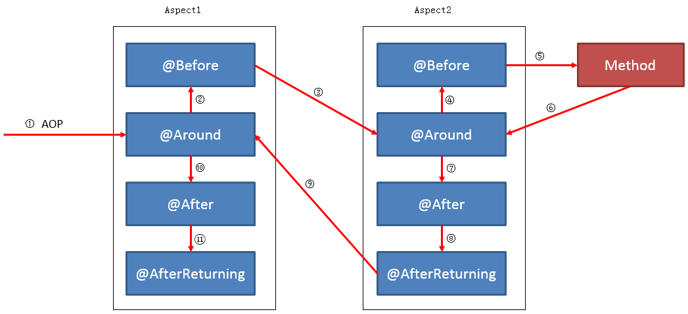

# spring 切面组织源码分析

## spring aop简介
在运行时，动态地将代码切入到类的指定方法、指定位置上的编程思想就是面向切面的编程。

## 实例
spring 中需配置aop
```xml
<?xml version="1.0" encoding="UTF-8"?>
<beans xmlns="http://www.springframework.org/schema/beans"
       xmlns:xsi="http://www.w3.org/2001/XMLSchema-instance" xmlns:aop="http://www.springframework.org/schema/aop"
       xsi:schemaLocation="http://www.springframework.org/schema/beans http://www.springframework.org/schema/beans/spring-beans.xsd
        http://www.springframework.org/schema/aop
        http://www.springframework.org/schema/aop/spring-aop.xsd">
    <import resource="classpath:conf/datasource.xml"/>
    <import resource="classpath:dubbo/provider.xml"/>
    <import resource="classpath:conf/spring-redis.xml"/>
    <aop:aspectj-autoproxy />
    <aop:config>
        <aop:aspect id="logAspect" ref="logInterceptor" order="11">
            <aop:pointcut id="servicePointcut"
                          expression="execution(public* com.test..*.*(..))"/>
            <aop:around pointcut-ref="servicePointcut" method="logAround"/>
            <aop:after pointcut-ref="servicePointcut" method="doAfter"/>
        </aop:aspect>
    </aop:config>
    <bean id="logInterceptor" class="com.test.aop.LogAspect1"/>
</beans>
```
``` java
public class LogAspect1 implements Ordered {
    private static Logger logger = LoggerFactory.getLogger(LogAspect.class);

    public LogAspect() {
    }

    public void doAfter(JoinPoint point) throws Exception {
        logger.info("doAfter");
    }

    public Object logAround(ProceedingJoinPoint proceeding) throws Exception {
        String clientIP = RpcContext.getContext().getRemoteHost();
        Object ret = proceeding.proceed(proceeding.getArgs());
        logger.info("requestIp:{}", clientIP);
        return ret;
    }
}
```
这样在执行时会输出
```java
requestIp:127.0.0.1
doAfter
```
## Aspect 执行顺序
Aspect 中提供了以下切面的方式:
* before：在join point 之前咨询的advice，不能阻止join point
* after： 在join point之后执行
* After throwing advice：join point 抛出异常后的advice
* After(finally) advice：在join point返回或者抛出异常之后的advice
* Around advice：在join point方法执行之前和之后的advice
调用顺序如下:
* 正常结束

* 出现异常

* 嵌套结构

那么spring 时如何组织和描述切面的呢?

## spring 组织切面源码分析
###  猜想
在看源码前,我以为会按照上面的流程逐层包装原有的函数. 类似
``` java
Object ret = origin;
while(nextAspect != null) {
    ret = wrap(ret, nextAspect);
    nextAspect = nextAspect.next;
}
return ret;
```
其中wrap为生成动态代理的函数,这样会有很多层动态代理.##

## 源码分析
spring 源码中处理aop 是将Advisor提前排序,然后递归调用
```java
protected List<Advisor> findEligibleAdvisors(Class<?> beanClass, String beanName) {
    List<Advisor> candidateAdvisors = this.findCandidateAdvisors();
    List<Advisor> eligibleAdvisors = this.findAdvisorsThatCanApply(candidateAdvisors, beanClass, beanName);
    this.extendAdvisors(eligibleAdvisors);
    if (!eligibleAdvisors.isEmpty()) {
        eligibleAdvisors = this.sortAdvisors(eligibleAdvisors);
    }

    return eligibleAdvisors;
}
```
前面两步返回有效的advisor,然后对advisor进行排序,排序实际按照优先级和Joinpoint的类型进行排序,优先级高的先执行:
```java
	protected List<Advisor> sortAdvisors(List<Advisor> advisors) {
		List<PartiallyComparableAdvisorHolder> partiallyComparableAdvisors =
				new ArrayList<PartiallyComparableAdvisorHolder>(advisors.size());
		for (Advisor element : advisors) {
			partiallyComparableAdvisors.add(
					new PartiallyComparableAdvisorHolder(element, DEFAULT_PRECEDENCE_COMPARATOR));
		}
		List<PartiallyComparableAdvisorHolder> sorted =
				PartialOrder.sort(partiallyComparableAdvisors);
		if (sorted != null) {
			List<Advisor> result = new ArrayList<Advisor>(advisors.size());
			for (PartiallyComparableAdvisorHolder pcAdvisor : sorted) {
				result.add(pcAdvisor.getAdvisor());
			}
			return result;
		}
		else {
			return super.sortAdvisors(advisors);
		}
	}
```
PartiallyComparableAdvisorHolder 将Advisor包装成为可比较对象,然后利用PartialOrder进行排序,首先看下PartiallyComparableAdvisorHolder的结构
```java
public PartiallyComparableAdvisorHolder(Advisor advisor, Comparator<Advisor> comparator) {
    this.advisor = advisor;
    this.comparator = comparator;
}

@Override
public int compareTo(Object obj) {
    Advisor otherAdvisor = ((PartiallyComparableAdvisorHolder) obj).advisor;
    return this.comparator.compare(this.advisor, otherAdvisor);
}
```
PartiallyComparableAdvisorHolder 实际就是利用DEFAULT_PRECEDENCE_COMPARATOR来比较Advisor,DEFAULT_PRECEDENCE_COMPARATOR 的代码如下:
```java
public AspectJPrecedenceComparator() {
    this.advisorComparator = AnnotationAwareOrderComparator.INSTANCE;
}
    @Override
public int compare(Advisor o1, Advisor o2) {
    int advisorPrecedence = this.advisorComparator.compare(o1, o2);
    if (advisorPrecedence == SAME_PRECEDENCE && declaredInSameAspect(o1, o2)) {
        advisorPrecedence = comparePrecedenceWithinAspect(o1, o2);
    }
    return advisorPrecedence;
}
```
首先利用advisorComparator 进行比较,如果相等,然后在比较comparePrecedenceWithinAspect,advisorComparator实际是AnnotationAwareOrderComparator,实现如下:
```java
	@Override
	public int compare(Object o1, Object o2) {
		return doCompare(o1, o2, null);
	}

	private int doCompare(Object o1, Object o2, OrderSourceProvider sourceProvider) {
		boolean p1 = (o1 instanceof PriorityOrdered);
		boolean p2 = (o2 instanceof PriorityOrdered);
		if (p1 && !p2) {
			return -1;
		}
		else if (p2 && !p1) {
			return 1;
		}

		// Direct evaluation instead of Integer.compareTo to avoid unnecessary object creation.
		int i1 = getOrder(o1, sourceProvider);
		int i2 = getOrder(o2, sourceProvider);
		return (i1 < i2) ? -1 : (i1 > i2) ? 1 : 0;
	}
```
可以看到这里主要是比较优先级,getOrder函数实现如下:
```java
private int getOrder(Object obj, OrderSourceProvider sourceProvider) {
    Integer order = null;
    if (sourceProvider != null) {
        Object orderSource = sourceProvider.getOrderSource(obj);
        if (orderSource != null && orderSource.getClass().isArray()) {
            Object[] sources = ObjectUtils.toObjectArray(orderSource);
            for (Object source : sources) {
                order = findOrder(source);
                if (order != null) {
                    break;
                }
            }
        }
        else {
            order = findOrder(orderSource);
        }
    }
    return (order != null ? order : getOrder(obj));
}

@Override
protected Integer findOrder(Object obj) {
    // Check for regular Ordered interface
    Integer order = super.findOrder(obj);
    if (order != null) {
        return order;
    }

    // Check for @Order and @Priority on various kinds of elements
    if (obj instanceof Class) {
        return OrderUtils.getOrder((Class<?>) obj);
    }
    else if (obj instanceof Method) {
        Order ann = AnnotationUtils.findAnnotation((Method) obj, Order.class);
        if (ann != null) {
            return ann.value();
        }
    }
    else if (obj instanceof AnnotatedElement) {
        Order ann = AnnotationUtils.getAnnotation((AnnotatedElement) obj, Order.class);
        if (ann != null) {
            return ann.value();
        }
    }
    else if (obj != null) {
        order = OrderUtils.getOrder(obj.getClass());
        if (order == null && obj instanceof DecoratingProxy) {
            order = OrderUtils.getOrder(((DecoratingProxy) obj).getDecoratedClass());
        }
    }

    return order;
}
```
对于相同优先级的Advisor会根据Advisor的类型进行比较:
```java
	private int comparePrecedenceWithinAspect(Advisor advisor1, Advisor advisor2) {
		boolean oneOrOtherIsAfterAdvice =
				(AspectJAopUtils.isAfterAdvice(advisor1) || AspectJAopUtils.isAfterAdvice(advisor2));
		int adviceDeclarationOrderDelta = getAspectDeclarationOrder(advisor1) - getAspectDeclarationOrder(advisor2);

		if (oneOrOtherIsAfterAdvice) {
			// the advice declared last has higher precedence
			if (adviceDeclarationOrderDelta < 0) {
				// advice1 was declared before advice2
				// so advice1 has lower precedence
				return LOWER_PRECEDENCE;
			}
			else if (adviceDeclarationOrderDelta == 0) {
				return SAME_PRECEDENCE;
			}
			else {
				return HIGHER_PRECEDENCE;
			}
		}
		else {
			// the advice declared first has higher precedence
			if (adviceDeclarationOrderDelta < 0) {
				// advice1 was declared before advice2
				// so advice1 has higher precedence
				return HIGHER_PRECEDENCE;
			}
			else if (adviceDeclarationOrderDelta == 0) {
				return SAME_PRECEDENCE;
			}
			else {
				return LOWER_PRECEDENCE;
			}
		}
	}
```
这里对于实现了AfterAdvice接口的对象,数值越大优先级越高,对于没有实现该借口的函数,数值越小优先级越高,其实和上面的嵌套的图对应,顺序时调用顺序的逆序.AfterAdvice接口会在之前的函数都完成后再调用. 相同优先级的Advisor,After比Around靠前.

上面还有个PartialOrder,这个类实际只进行偏序排序,如果两个Advisor 拍不出优先级,哪个在前都可以
```java
public static List sort(List objects) {
    // lists of size 0 or 1 don't need any sorting
    if (objects.size() < 2) {
        return objects;
    }

    // ??? we might want to optimize a few other cases of small size

    // ??? I don't like creating this data structure, but it does give good
    // ??? separation of concerns.
    List<SortObject> sortList = new LinkedList<SortObject>(); // objects.size());
    for (Iterator i = objects.iterator(); i.hasNext();) {
        addNewPartialComparable(sortList, (PartialComparable) i.next());
    }

    // System.out.println(sortList);

    // now we have built our directed graph
    // use a simple sort algorithm from here
    // can increase efficiency later
    // List ret = new ArrayList(objects.size());
    final int N = objects.size();
    for (int index = 0; index < N; index++) {
        // System.out.println(sortList);
        // System.out.println("-->" + ret);

        SortObject leastWithNoSmallers = null;

        for (Iterator i = sortList.iterator(); i.hasNext();) {
            SortObject so = (SortObject) i.next();
            // System.out.println(so);
            if (so.hasNoSmallerObjects()) {
                if (leastWithNoSmallers == null || so.object.fallbackCompareTo(leastWithNoSmallers.object) < 0) {
                    leastWithNoSmallers = so;
                }
            }
        }

        if (leastWithNoSmallers == null) {
            return null;
        }

        removeFromGraph(sortList, leastWithNoSmallers);
        objects.set(index, leastWithNoSmallers.object);
    }

    return objects;
}
private static class SortObject {
    PartialComparable object;
    List<SortObject> smallerObjects = new LinkedList<SortObject>();
    List<SortObject> biggerObjects = new LinkedList<SortObject>();
}
```
这里的实现按照对象间的关系保存一个图结构DAG,然后遍历DAG,找出当前优先级最低的节点,然后删除节点在图中的所有信息,循环此过程直到所有的节点都处理为止.到得一个偏序的链表

在这里可能有个疑问,相同的优先级都优先调用如何实现前面的调用关系?

### 运行时调用顺序
#### JdkDynamicAopProxy
JdkDynamicAopProxy 是依据Advisor生成的动态代理,实际执行的函数为
```java
public Object invoke(Object proxy, Method method, Object[] args) throws Throwable {
    ...
    List<Object> chain = this.advised.getInterceptorsAndDynamicInterceptionAdvice(method, targetClass);
    if (chain.isEmpty()) {
        // We can skip creating a MethodInvocation: just invoke the target directly
        // Note that the final invoker must be an InvokerInterceptor so we know it does
        // nothing but a reflective operation on the target, and no hot swapping or fancy proxying.
        Object[] argsToUse = AopProxyUtils.adaptArgumentsIfNecessary(method, args);
        retVal = AopUtils.invokeJoinpointUsingReflection(target, method, argsToUse);
    }
    else {
        // We need to create a method invocation...
        invocation = new ReflectiveMethodInvocation(proxy, target, method, args, targetClass, chain);
        // Proceed to the joinpoint through the interceptor chain.
        retVal = invocation.proceed();
    }
    ...
}
```
如果没有Advisor,则直接调用方法,如果有Advisor则通过ReflectiveMethodInvocation调用,其中process函数实现如下
``` java
public Object proceed() throws Throwable {
    //	We start with an index of -1 and increment early.
    if (this.currentInterceptorIndex == this.interceptorsAndDynamicMethodMatchers.size() - 1) {
        return invokeJoinpoint();
    }
    // 调用下一个Advisor
    Object interceptorOrInterceptionAdvice =
            this.interceptorsAndDynamicMethodMatchers.get(++this.currentInterceptorIndex);
    if (interceptorOrInterceptionAdvice instanceof InterceptorAndDynamicMethodMatcher) {
        // Evaluate dynamic method matcher here: static part will already have
        // been evaluated and found to match.
        InterceptorAndDynamicMethodMatcher dm =
                (InterceptorAndDynamicMethodMatcher) interceptorOrInterceptionAdvice;
        if (dm.methodMatcher.matches(this.method, this.targetClass, this.arguments)) {
            return dm.interceptor.invoke(this);
        }
        else {
            // Dynamic matching failed.
            // Skip this interceptor and invoke the next in the chain.
            return proceed();
        }
    }
    else {
        // It's an interceptor, so we just invoke it: The pointcut will have
        // been evaluated statically before this object was constructed.
        return ((MethodInterceptor) interceptorOrInterceptionAdvice).invoke(this);
    }
}
```
可以看到这里调用实际是递归调用,invoke传入的参数时this,以After为例
```java
public Object invoke(MethodInvocation mi) throws Throwable {
    Object var2;
    try {
        var2 = mi.proceed();
    } finally {
        this.invokeAdviceMethod(this.getJoinPointMatch(), (Object)null, (Throwable)null);
    }
    return var2;
}
```
这里的mi就是上面的ReflectiveMethodInvocation,并且在前面说明中 After比Around优先调用,但是用户自定义过程比Around迟.按照该函数会先执行ReflectiveMethodInvocation.proceed,按照proceed方法的说明如果有Advisor就执行advisor的切面,这样如果有一个Aspect需要执行After和Around,
先执行After,在After中递归调用到Around,在Around执行完成后,堆栈退回执行invokeAdviceMethod


