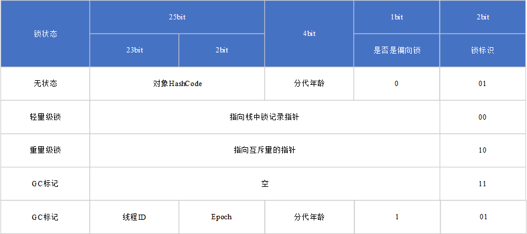

# java Synchronized
## 引言
Synchronized 作为java 中的常用同步方法,本文介绍Synchronized相关的概念,自旋锁,偏向锁,轻量级锁,重量级锁

## 性能
在java1.6之前Synchronized的性能较差,直接依赖于操作系统提供的mutex网上大部分说法是会直接陷入系统调用,导致性能很差.但是实际上在2.6内核以后引入futex,mutex在没有冲突的情况是不会陷入系统调用的.查询java1.5的发布时间在J2SE 5.0 (1.5.0) Tiger,老虎 2004-10,但是支持futex的kernel的发布时时间再2.5 releasedJuly 2, 2003,glibc引入futex则更晚.如果synchronized依赖futex的话,实际性能不会那么差.

##MarkWord/对象头
HotSpot虚拟机中,对象在内存中的布局可以分为三块,对象头(Header),实例数据(Instance Data)和对齐数据(Padding)
HotSpot虚拟机的对象头包括两部分信息:
* 对象自身运行时的数据: 如哈希码(HashCode),GC分代年龄,锁状态标识,线程持有的锁,偏向线程ID,偏向时间戳等
* 指向累的元数据的指针:虚拟机通过这个指针来确定这个对象是哪个类的实例.并不是所有的虚拟机都在对象数据上保存类型指针.这个类似于C++中虚函数指针.

## 轻量级锁
轻量级锁类似于自旋锁. 加锁过程
1) copy对象markword到当前堆栈中
2) cas markword指向当前堆栈,如果成功则继续执行,如果失败,当时owner是当前线程,也继续执行,否则膨胀为重量级锁

解锁过程:
1) 将原始的数据重新cas到markword中

## 偏向锁
偏向锁的目标是为了减少加锁的次数,适用于统一时刻只有一个线程在用锁的场景
加锁过程
1) cas 当前markword,如果成功则获得锁,如果失败则进入safepoint,锁撤销后升级锁到轻量级锁
解锁过程:
偏向锁本身不进行解锁,但是可以重偏向.
重偏向的过程:
1. 如果偏向锁已经被加锁,在safepoint时,检查占有该偏向锁的线程是否还存在,如果存在则升级偏向锁,如果不存在则进行重偏向

撤销的过程:
偏向锁的撤销： 偏向锁使用了一种等到竞争出现才释放锁的机制，所以当其他线程尝试竞争偏向锁时，持有偏向锁的线程才会释放锁。偏向锁的撤销，需要等待全局安全点（在这个时间点上没有字节码正在执行），它会首先暂停拥有偏向锁的线程，然后检查持有偏向锁的线程是否活着，如果线程不处于活动状态，则将对象头设置成无锁状态，如果线程仍然活着，拥有偏向锁的栈会被执行，遍历偏向对象的锁记录，栈中的锁记录和对象头的Mark Word要么重新偏向于其他线程，要么恢复到无锁或者标记对象不适合作为偏向锁，最后唤醒暂停的线程。

## 问题为什么偏向锁需要全局检查点,而轻量级锁不需要
因为偏向锁没有释放的过程,如果所在的线程一直在运行,是无法判断锁当前是否被使用的,只能通过暂停线程来升级,当时为什么不是只暂停申请线程和持有线程呢?假如A持有偏向锁,B持有锁,A,B到safepoint停止后,唤醒VMTHread处理锁撤销,在撤销的过程中C也到检查点,此时C需要发送撤销操作,但是和前面重复,如果不发送又不能撤销锁

https://blog.csdn.net/iter_zc/article/details/41847887
